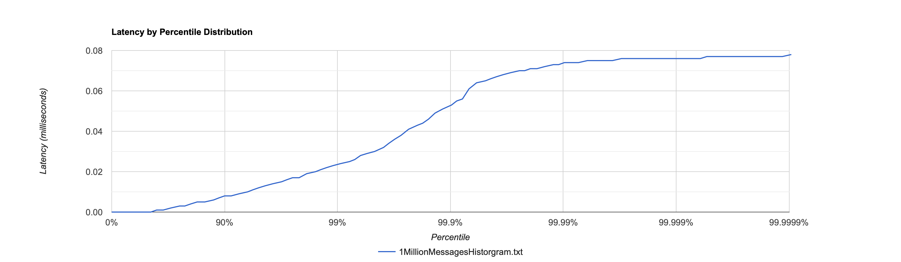

# app-trade-position-engine

Trade position engine is aeron based app used for publishing and consuming SBE trade messages, and calculating position aggregation by account and security. 
The app is developed to be low latency by using busy spin on aeron media driver for both publication and subscriptions.

The app uses single write and read pattern to avoid context switching when running multiple threads. Aeron does support multiple publications on same stream, so publishers (Trader publisher) can be multithreaded? or publishing from multiple jvm apps.
However, for trade processing and position calculation, the app will use single consumer using dedicated single duty cycle thread and using non-blocking data structures.

For high throughput, aeron also supports binding thread to a core which can be used for duty cycle event loop thread.

For low garbage, agrona collections data structures have been used, but happy to discuss usage of core java data structures as per one of the requirement of the exercise.

## Local running

Build project using gradle. For simplicity, I have copied generated SBE codecs (both encoders and decoders under sbe package)

Run below class and both position aggregation and latency stats will be written on console at the end

[TradePositionEngineApp.java](src/main/resources/com/bofa/equity/TradePositionEngineApp.java)

```
// Change below count to play with publisher count under TradePositionEngineApp class
final int sendCount = 1_000_000;
```

for JDK 14 and above please use extra VM arguments, as sun nio packages access is blocked now by default 
```
--add-opens java.base/sun.nio.ch=ALL-UNNAMED
```
For Step 3 requirement, we can move the subscription and embedded aeron launch to one JVM, and publication to other JVM using either ipc or udp publications

## SBE Messages schema

Trade SBE schema message with memory footprint can be found below
[Trade SBE schema](src/main/resources/messages.xml)

## Latency

Infra: Using 1 million messages on MacOS 2 GHz Dual Core i5 with 16 GB SSD memory

Below chart shows message creation time vs message processing time(it does include time taken over aeron media driver + duty cycles loop)



If you want to plot files from your machine, please copy the output of latency numbers from console to a file (like 1MillionMessagesHistogram.txt) and use
http://hdrhistogram.github.io/HdrHistogram/plotFiles.html to generate plots

[ReceiveAgent](src/main/java/com/bofa/equity/agents/ReceiveAgent.java) logs the overall time taken by consumer to process the trade messages.
However, this doesn't give up clear picture as producer can be back pressured or slow.

## Improvements

```
Warm up messages on startup and/or after some interval
Object pooling, can verify GC logs while app is running and trim down on garbage objects. 
Duty loop thread bound to core
Break down Trade message data and publish position aggregation data on one stream and regulatory/text data on another stream
Better latency measurements
BDD Integration tests using cucumber to bring up app and publish/consumer message to validate the message generation and consumtions in real time.
```

## Contributing

Jasandeep Singh
